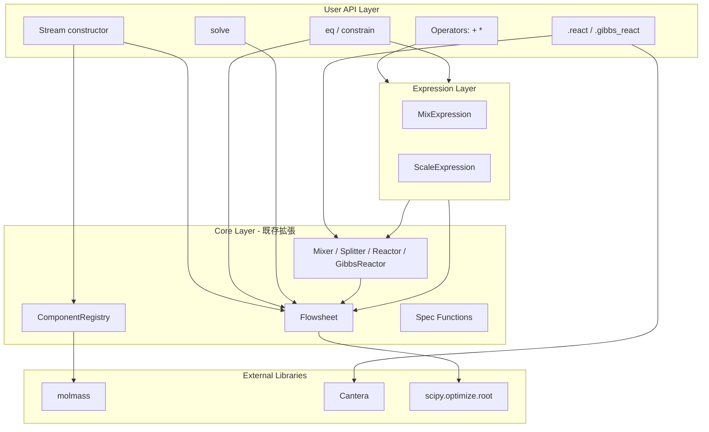
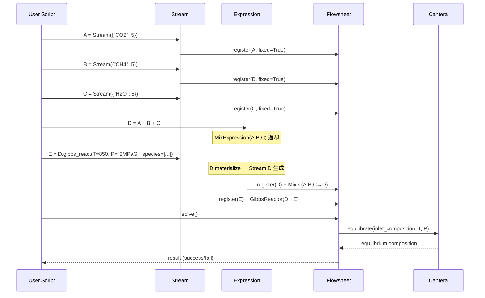
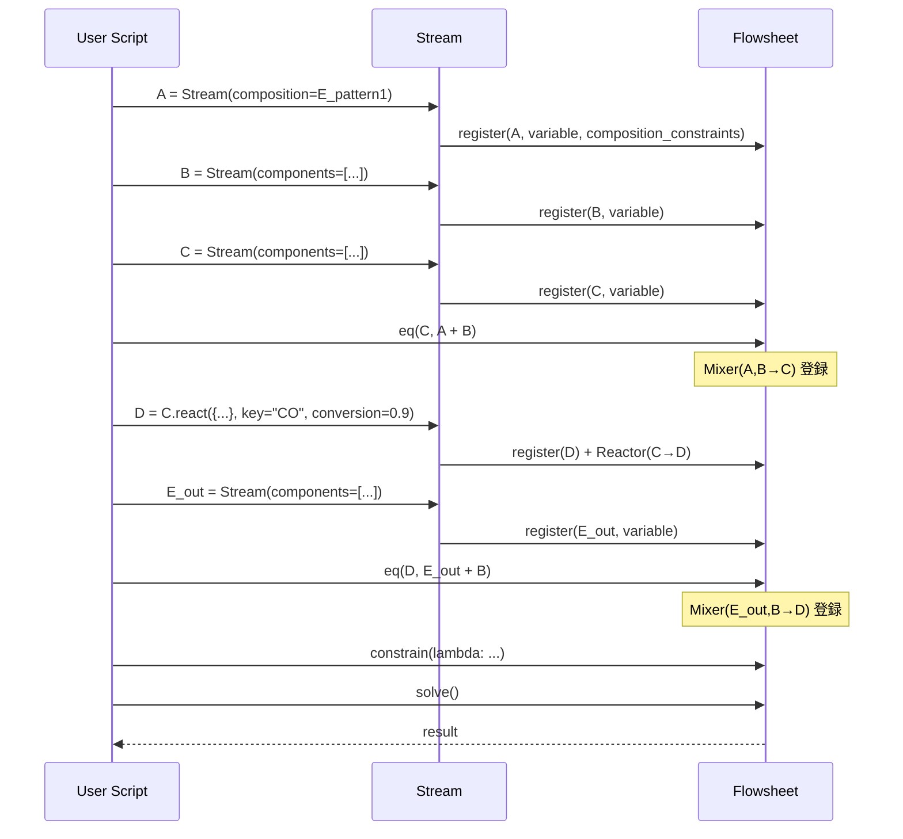

# Technical Design Document: chemflow-intuitive-api

## Overview

**Purpose**: chemflowの冗長なAPI（Component手動定義、Flowsheet手動構築、fix_stream等）を、演算子ベース・示性式自動認識・暗黙的Flowsheet構築の直感的APIに置き換える。

**Users**: 化学プロセスエンジニアが、Pythonスクリプトで定常状態プロセス計算を記述する。

**Impact**: 既存の内部アーキテクチャ（residual方式 + scipy.optimize.root）は維持しつつ、ユーザー向けAPIレイヤーを全面的に刷新する。

### Goals
- 演算子（`+`, `*`）でストリーム間の関係を記述
- 示性式文字列から分子量を自動計算（Component手動定義の廃止）
- Flowsheet構築・fix_stream を不要にする
- 転化率指定Reactor と Gibbsリアクター（Cantera）の両方を簡潔に記述
- 循環系を含む任意の制約条件を `eq()` / `constrain()` で記述

### Non-Goals
- 熱収支・温度・圧力プロファイルの追跡（Gibbsリアクターの入力条件としてのみ使用）
- 相平衡・蒸留計算
- GUI

## Architecture

### High-Level Architecture



### Technology Alignment

| 既存 | 変更 |
|------|------|
| Component手動定義 | ComponentRegistry + molmass自動計算 |
| Stream(name, components_list) | Stream(dict, basis=...) |
| Mixer/Splitter/Reactor 手動生成 | 演算子 / メソッドで自動生成 |
| Flowsheet手動構築 | グローバルFlowsheetに自動登録 |
| — | GibbsReactor（Cantera連携、新規） |
| — | eq() / constrain()（新規） |

### Key Design Decisions

#### Decision 1: Expression（遅延評価）パターン

**Context**: `A + B` はPythonの `__add__` で即座に評価されるが、`eq(C, A + B)` では新しいStreamを作らずに既存のCに紐付けたい。

**Alternatives**:
1. `__add__` が即座にStreamを作り、`eq()` で後から差し替え
2. `__add__` がExpressionを返し、使用時に遅延materialize
3. `eq()` に専用構文を使う（`eq(C, [A, B], "mix")`）

**Selected**: 案2 — Expression遅延評価パターン

**Rationale**: `C = A + B`（Expression→自動materialize→Stream生成）と `eq(C, A + B)`（Expression→既存Cに紐付け）を同一の `__add__` で実現できる。ユーザーは両方の場面で同じ `+` 記法を使える。

**Trade-offs**: Expressionクラスの追加が必要だが、Stream全プロパティをプロキシすることでユーザーには透過的。

#### Decision 2: グローバルFlowsheet

**Context**: ユーザーがFlowsheetを明示的に作成・管理するのは煩雑。

**Selected**: モジュールレベルのグローバルFlowsheetインスタンス。全操作が暗黙的に登録される。`solve()` はモジュールレベル関数。`reset()` でクリア。

**Rationale**: 1つのスクリプトで1つのプロセスを解くユースケースに最適。複数Flowsheetが必要な場合は `with Flowsheet() as fs:` のコンテキストマネージャで対応可能（将来拡張）。

#### Decision 3: constrain() はlambdaベース

**Context**: `constrain(C.total_molar_flow, 30)` と書きたいが、`C.total_molar_flow` はプロパティなので呼び出し時点で float に評価されてしまい、遅延評価できない。

**Alternatives**:
1. プロパティをPropertyRefオブジェクトに変更（既存API破壊）
2. 文字列指定: `constrain(C, "total_molar_flow", 30)`
3. lambda: `constrain(lambda: C.total_molar_flow - 30)`

**Selected**: 案3 — lambdaベース

**Rationale**: Pythonの標準的なclosure。任意の複雑な制約を表現可能。戻り値はスカラーまたはnp.ndarray（残差ベクトル）。

```python
constrain(lambda: C.total_molar_flow - 30)
constrain(lambda: A.total_mass_flow - E_out.total_mass_flow)
constrain(lambda: D.mole_fractions - E_out.mole_fractions)  # 均一組成
```

#### Decision 4: Gibbsリアクターの統合方式

**Context**: Canteraの `equilibrate('TP')` は直接計算（入力→出力）だが、chemflowはresidual方式（全体連立方程式）。

**Selected**: 常にresidual方式で統合。残差 = outlet_flows - cantera_equilibrium(inlet_flows)。

**Rationale**: 循環系でinletが未知の場合でも対応可能。inletが既知の場合はsolver が1イテレーションで収束するので性能上の問題はない。Canteraの `equilibrate` は各イテレーションで呼ばれる。

## System Flows

### パターン1: Gibbs平衡計算



### パターン2: 循環系



## Requirements Traceability

| Req | 概要 | Components | 実現方法 |
|-----|------|-----------|---------|
| 1 | 示性式→分子量 | ComponentRegistry | molmass.Formula().mass |
| 2 | Stream簡潔定義 | Stream constructor | dict入力、basis変換、composition指定 |
| 3 | 演算子装置接続 | StreamExpression | __add__ → MixExpr, __mul__ → ScaleExpr |
| 4 | eq関数 | eq() | Expression消費 → 既存Streamに紐付け |
| 5 | 転化率Reactor | Stream.react() | StoichReactor残差式 |
| 6 | Gibbsリアクター | Stream.gibbs_react() | Cantera equilibrate + 残差統合 |
| 7 | constrain | constrain() | lambda → Flowsheet.add_spec |
| 8 | 自動構築 | GlobalFlowsheet | 全操作で暗黙登録 |
| 9 | 結果出力 | Stream properties + print | 既存拡張 |
| 10 | パターン1 | 上記1,2,3,6,8の組合せ | — |
| 11 | パターン2 | 上記1,2,3,4,5,7,8の組合せ | — |

## Components and Interfaces

### Component Layer

#### ComponentRegistry

**Responsibility**: 示性式文字列 → Componentオブジェクトの変換とキャッシュ。

**Dependencies**:
- **External**: molmass（`Formula().mass` で分子量計算）

**Contract**:
```python
class ComponentRegistry:
    _cache: dict[str, Component]  # {"H2": Component("H2", 2.016), ...}

    @classmethod
    def get(cls, formula: str) -> Component:
        """示性式からComponentを取得。キャッシュあり。"""
        # molmass.Formula(formula).mass で分子量を計算
        # FormulaError 時は ChemflowError に変換

    @classmethod
    def get_many(cls, formulas: list[str]) -> list[Component]:
        """複数の示性式を一括取得。"""

    @classmethod
    def clear_cache(cls) -> None:
        """キャッシュをクリア。"""
```

### Expression Layer

#### StreamExpression（基底クラス）

**Responsibility**: ストリーム演算の遅延表現。使用時にmaterializeしてStreamを生成するか、`eq()` で既存Streamに紐付ける。

**Contract**:
```python
class StreamExpression:
    _op: str              # "mix" or "scale"
    _operands: list       # Stream or Expression のリスト
    _materialized: Stream | None

    def materialize(self, target: Stream | None = None) -> Stream:
        """
        target=None: 新しいStreamを生成し、Flowsheetに残差式を登録。
        target=Stream: 既存Streamに紐付けて残差式を登録（eq用）。
        """

    # Stream のプロパティ/メソッドをプロキシ
    def react(self, stoich, key, conversion) -> Stream: ...
    def gibbs_react(self, T, P, species) -> Stream: ...
    def __add__(self, other) -> StreamExpression: ...
    def __mul__(self, ratio) -> StreamExpression: ...
    def __getattr__(self, name): ...  # 未定義属性は materialize() 経由
```

#### MixExpression

```python
class MixExpression(StreamExpression):
    """A + B + C → Mixer残差式"""
    _op = "mix"
    _operands: list[Stream | StreamExpression]

    def materialize(self, target=None) -> Stream:
        # operands 内の Expression を先に materialize
        # 全成分の和集合で出口 Stream を生成（or target を使用）
        # Mixer 残差式を Flowsheet に登録
```

#### ScaleExpression

```python
class ScaleExpression(StreamExpression):
    """A * 0.4 → Split残差式"""
    _op = "scale"
    _operands: tuple[Stream | StreamExpression, float]  # (stream, ratio)

    def materialize(self, target=None) -> Stream:
        # 出口 Stream を生成（or target を使用）
        # Split 残差式を Flowsheet に登録
```

### User API Layer

#### Stream（リデザイン）

**Responsibility**: ストリームの定義・保持・演算子提供。

**Contract**:
```python
class Stream:
    def __init__(
        self,
        flows: dict[str, float] | None = None,
        *,
        basis: str = "mol",           # "mol","mass","normal_volume","mole_frac","mass_frac","volume_frac"
        total: float | None = None,   # 比率系basis時の合計流量
        components: list[str] | None = None,  # 未知ストリーム用
        composition: 'Stream' | None = None,  # 他ストリームと同組成
        name: str | None = None,
    ):
        """
        固定ストリーム: Stream({"H2": 20, "N2": 60})
        basis指定:     Stream({"H2": 20, "N2": 60}, basis="mass")
        比率+合計:     Stream({"H2": 0.75, "N2": 0.25}, basis="mole_frac", total=100)
        組成のみ:      Stream({"H2": 0.75, "N2": 0.25}, basis="mole_frac")
                         → 組成制約を登録、total_flowは未知
        未知:          Stream(components=["H2", "N2", "NH3"])
        他と同組成:    Stream(composition=other_stream)
                         → 組成一致制約を登録、total_flowは未知
        タプル混在:    Stream({"N2": (20, "mol"), "H2": (120, "mass")})
        CSV:           Stream.from_csv("feed.csv")
        """

    # --- 演算子 ---
    def __add__(self, other: 'Stream | StreamExpression') -> MixExpression: ...
    def __radd__(self, other) -> MixExpression: ...
    def __mul__(self, ratio: float) -> ScaleExpression: ...
    def __rmul__(self, ratio: float) -> ScaleExpression: ...

    # --- リアクター ---
    def react(
        self,
        stoichiometry: dict[str, float],  # {"CO": -2, "H2": -2, "CH3COOH": 1}
        key: str,                          # 基準成分の示性式
        conversion: float,                 # 転化率 (0~1)
    ) -> 'Stream':
        """転化率指定リアクター。出口Streamを返す。"""

    def gibbs_react(
        self,
        T: float,                          # 温度 [°C]
        P: float | str,                    # 圧力 [Pa] or "2MPaG" 等の文字列
        species: list[str],                # 平衡種リスト
    ) -> 'Stream':
        """Gibbsリアクター。Cantera使用。出口Streamを返す。"""

    # --- プロパティ（既存維持） ---
    @property
    def total_molar_flow(self) -> float: ...
    @property
    def total_mass_flow(self) -> float: ...
    @property
    def total_normal_volume_flow(self) -> float: ...
    @property
    def mole_fractions(self) -> np.ndarray: ...
    @property
    def mass_fractions(self) -> np.ndarray: ...
    @property
    def molar_flows(self) -> np.ndarray: ...
    @property
    def mass_flows(self) -> np.ndarray: ...

    # --- CSV ---
    @classmethod
    def from_csv(cls, path: str, **kwargs) -> 'Stream': ...
```

**Streamの固定/未知の判定ロジック**:
| 入力 | 判定 | 理由 |
|------|------|------|
| `flows` dict あり + basis が絶対量 | 固定 | 全成分の値が確定 |
| `flows` dict あり + basis が比率 + `total` あり | 固定 | 比率×totalで確定 |
| `flows` dict あり + basis が比率 + `total` なし | 未知（組成制約付き） | totalが未知 |
| `components` のみ | 未知 | 全値が未知 |
| `composition` 指定 | 未知（組成制約付き） | 組成は拘束、totalが未知 |

#### グローバル関数

```python
# --- flowsheet module-level API ---

def eq(target: Stream, expression: StreamExpression) -> None:
    """既存StreamにExpression の残差式を紐付ける。"""
    expression.materialize(target=target)

def constrain(residual_func: Callable[[], float | np.ndarray]) -> None:
    """任意の制約条件をlambdaで登録する。
    residual_func は残差（= 0 になるべき値）を返す。"""
    _get_flowsheet().add_spec(lambda: np.atleast_1d(residual_func()))

def solve(**kwargs) -> SolveResult:
    """グローバルFlowsheetの連立方程式を求解する。"""
    return _get_flowsheet().solve(**kwargs)

def reset() -> None:
    """グローバルFlowsheetをクリアし、新しいFlowsheetを開始する。"""

def print_streams() -> None:
    """全ストリームの結果を一覧表示する。"""
    _get_flowsheet().print_streams()
```

### Core Layer（既存拡張）

#### GibbsReactor（新規）

**Responsibility**: Canteraを使ったギブズ自由エネルギー最小化。残差式を返す。

**Dependencies**:
- **External**: Cantera（`ct.Solution`, `equilibrate('TP')`）

**Contract**:
```python
class GibbsReactor:
    def __init__(
        self,
        inlet: Stream,
        outlet: Stream,
        T_celsius: float,
        P_pascal: float,
        species: list[str],
    ):
        """
        Cantera Solution を species リストから構築。
        gri30.yaml から該当 species をフィルタして使用。
        """

    def residuals(self) -> np.ndarray:
        """
        1. inlet の組成を Cantera Solution に設定
        2. equilibrate('TP') で平衡計算
        3. 残差 = outlet.molar_flows - equilibrium_molar_flows
        """
```

**Cantera統合の詳細**:
```python
# 初期化時
all_species = ct.Species.list_from_file('gri30.yaml')
selected = [s for s in all_species if s.name in species_list]
self._gas = ct.Solution(thermo='ideal-gas', species=selected)

# residuals() 呼び出し時
self._gas.TPX = T_kelvin, P_pascal, inlet_mole_fractions
self._gas.equilibrate('TP')
eq_fractions = self._gas.X
eq_molar_flows = eq_fractions * inlet.total_molar_flow
return outlet.molar_flows - eq_molar_flows
```

**圧力文字列パース**:
| 入力 | 解釈 |
|------|------|
| `2000000` (数値) | 2 MPa (absolute) |
| `"2MPaG"` | 2 MPa gauge → 2101325 Pa absolute |
| `"2MPa"` | 2 MPa absolute → 2000000 Pa |
| `"10atm"` | 10 × 101325 Pa |

#### Flowsheet（拡張）

既存のFlowsheetクラスを拡張:
- 成分の動的追加: 演算中に新しい成分が登場したら全ストリームの次元を拡張
- 組成制約の管理: composition指定ストリームのmole_fraction制約
- グローバルインスタンス管理

#### Mixer / Splitter / Reactor（既存維持）

内部的には現行と同じ残差式を生成。ユーザーが直接触る必要がなくなるだけ。

### 成分次元の動的管理

異なる成分セットを持つストリーム間の演算時:

```python
s1 = Stream({"N2": 20, "H2": 60})           # [N2, H2]
s2 = Stream({"H2": 5, "NH3": 10})           # [H2, NH3]
s3 = s1 + s2                                # [N2, H2, NH3] — 和集合
```

**方式**: Flowsheetが全成分のマスターリストを管理。ストリームは自身のcomponents→マスターリストへのインデックスマッピングを持つ。新しい成分が登場するたびにマスターリストに追加。

## Data Models

### Stream 内部構造

```
Stream
├── name: str | None
├── components: list[Component]          # このストリームに存在する成分
├── molar_flows: np.ndarray              # 求解変数（len = len(components)）
├── _fixed: bool                         # True: 固定値, False: 求解対象
├── _composition_constraints: list       # 組成制約（比率指定・composition指定時）
└── _flowsheet: Flowsheet               # 所属するFlowsheet
```

### Component（内部、ユーザー非公開）

```
Component
├── formula: str        # "H2", "CO2" etc.
├── mw: float           # 分子量 [g/mol]（molmassから自動計算）
└── normal_volume: float # ノルマル体積 [L/mol]（22.414 固定）
```

## Error Handling

### Error Categories

| エラー | 原因 | メッセージ例 |
|--------|------|-------------|
| `FormulaError` | 不正な示性式 | "Unknown formula: 'XYZ'" |
| `BasisError` | 比率系basisでtotal未指定かつ未知でない | "basis='mole_frac' requires 'total' or composition-only mode" |
| `SolveError` | 求解が収束しない | "Solver did not converge: {details}" |
| `ConstraintError` | 制約式の次元不整合 | "Constraint returned 3 residuals but expected 1" |
| `CantaraError` | Cantera平衡計算失敗 | "Gibbs equilibrium failed: {details}" |

すべて `ChemflowError` のサブクラスとする。

## Testing Strategy

### Unit Tests
- ComponentRegistry: 各示性式の分子量が正しいか（H2O=18.015等）
- Stream: 各basis（mol, mass, normal_volume, mole_frac等）からのモル流量変換
- StreamExpression: materialize時のStream生成と残差式登録
- GibbsReactor: Cantera平衡計算の残差が正しいか

### Integration Tests
- パターン1全体: 3ストリーム混合 → Gibbs平衡 → 結果検証
- パターン2全体: 循環系 → 物質収支の成立確認
- 成分自動マージ: 異なる成分セットの混合
- 組成制約: composition指定ストリームの求解

### E2E Tests
- パターン1 + パターン2の連結（E → A の受け渡し）
- CSVからのストリーム読み込み → 求解 → 結果表示
